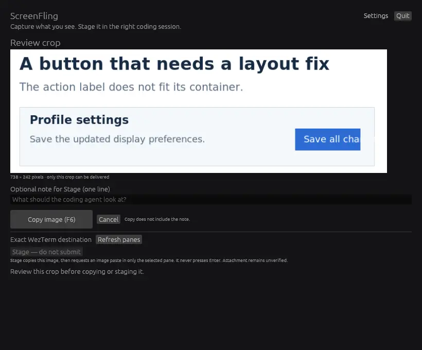

<div align="center">
  
  <h1>ScreenFling</h1>
  <p><strong>Show the problem. Keep your context.</strong></p>
  <p>Capture a screen region, review it, and bring it into your coding session.</p>
  <p><strong>Rust</strong> · egui · SDL3 / OpenGL · Windows / macOS / Linux</p>
  <p><a href="#try-it">Build & run</a> · <a href="#engineering">Engineering</a> · <a href="docs/USAGE.md">User guide</a></p>
</div>



*The running native app with a synthetic deployment error. Stage becomes available after connection and destination setup.*

A screenshot often explains a bug faster than a paragraph. ScreenFling removes the file-saving and path-copying steps: review a crop, then copy it or stage it in the exact local WezTerm pane you choose. With several coding sessions open, the destination stays explicit.

## How it works

1. **Capture.** Use the Capture button or global shortcut, then select a region on the frozen display.
2. **Review.** Inspect the original crop with Fit or 1:1 preview. Add an optional note.
3. **Copy or stage.** Copy the image for manual pasting, or Stage it in your selected WezTerm pane. Reveal that destination separately.

Copy works without terminal setup. **Stage sends Ctrl+V and your note, never Enter.** It requires a local coding agent whose Ctrl+V binding attaches an image; inspect the attachment before submitting. See [Stage setup](docs/USAGE.md#configure-stage-in-wezterm).

## Engineering

- **Native platform integration.** Rust, egui and SDL3 connect Windows capture, macOS ScreenCaptureKit, X11 and Wayland ScreenCast/PipeWire to one image model. The UI waits when idle; a bounded worker handles desktop operations. [Platform adapters](src/capture/) · [architecture](docs/DEVELOPMENT.md#code-map-and-boundaries)
- **Original pixels throughout.** Selection maps to actual captured dimensions, including fractional display scaling. Resizing the preview never resizes the delivered crop. [Geometry and crop tests](src/model.rs)
- **Explicit state transitions.** Capture generations prevent late background results from advancing an abandoned capture. Delivery requires the current reviewed image. [State machine](src/model.rs) · [application flow](src/app.rs)
- **An exact destination.** Stage validates the connection and pane/window/tab IDs, then checks the clipboard against the reviewed image. Changed destinations and uncertain results never trigger a fallback or automatic retry. [Routing](src/wezterm.rs) · [relay](src/relay.rs)

[CI](.github/workflows/check.yml) builds, lints, tests and packages all three platforms. Integration checks compare every crop pixel on X11 and on Wayland at 125% scale, verify native image clipboards, and use a real disposable WezTerm session to check routing and no-submit behavior. [Reproduce the checks](docs/DEVELOPMENT.md#checks).

## Try it

Install **Rust, CMake and a native C/C++ toolchain**. Follow the [platform prerequisites](docs/DEVELOPMENT.md#build-prerequisites), including Linux development libraries and macOS 14+.

```sh
git clone https://github.com/d-sandhu/screenfling.git
cd screenfling
cargo run --release --locked
```

Start with **Capture region** or **F8**. The [user guide](docs/USAGE.md) covers shortcuts, permissions and WezTerm setup.

## Status

**Pre-release.** Automated checks cover Windows x86-64, macOS Apple Silicon and Linux x86-64. Physical desktop testing, real coding-agent attachment, and public signing/notarization remain on the [release checklist](docs/DEVELOPMENT.md#remaining-release-acceptance).

[Development & contributing](docs/DEVELOPMENT.md) · [Visual design](docs/VISUALS.md) · [Report an issue](https://github.com/d-sandhu/screenfling/issues) · [MIT](LICENSE)
