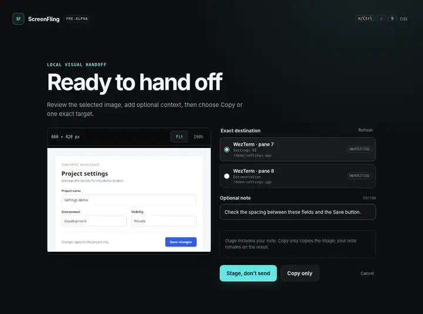

# ScreenFling

**Capture a screen region. Choose a coding session. Stage it without pressing Enter.**

[](https://github.com/d-sandhu/screenfling/actions/workflows/check.yml)

Electron · React · TypeScript · Node.js

When several coding sessions are open, the awkward part of a screenshot is the
handoff: finding the right pane, pasting the image, and adding context. ScreenFling
puts those steps in one local desktop workflow. It does not run a model or submit
a prompt for you.



*Interface preview using the packaged renderer with synthetic image and destination
data. This is not a recording of native capture or agent attachment.*

## The workflow

1. **Capture.** Press **Cmd+Shift+9** on macOS, or click **Capture region**, then drag on one display.
2. **Review.** Inspect the crop with **Fit** or **100%**. Add an optional note.
3. **Choose.** Use **Copy only** for a normal image paste, or select an exact WezTerm pane and choose **Stage, don’t send**.
4. **Inspect.** Check the destination before submitting. **Reveal destination** is a separate action.

Copy works without WezTerm and copies only the image. Stage uses the selected
pane's configured image-attachment key and includes the note. Its result stays
**Staged — unverified**: a successful terminal write is not proof that an agent
attached the image. There is no automatic retry or active-window fallback.

[Connection setup, permissions, and troubleshooting →](docs/usage.md)

## Run from source

Use the Node version in [`.node-version`](.node-version). On macOS, install Apple's
Command Line Tools once with `xcode-select --install`.

```bash
git clone https://github.com/d-sandhu/screenfling.git
cd screenfling
npm install --global "$(node -p 'require("./package.json").packageManager')"
npm ci
npm start
```

The first start downloads the pinned Electron binary. Grant Screen Recording to
the build you run, then quit and reopen it. Use `npm run package:mac` for a local
app bundle, or see [macOS test builds](docs/usage.md#macos-test-builds).

## Engineering choices

The UI presents the workflow; Electron's main process owns capture, clipboard,
settings, and terminal operations. Key design decisions:

| Problem | Design and code |
| --- | --- |
| Late events from an old capture | Main-owned [workflow state](src/shared/workflow.ts) and operation IDs reject stale actions. |
| Privileged desktop access | Separate [preload bridges](src/preload/index.ts), runtime schemas, and [IPC sender checks](src/main/ipc-sender.ts) limit each renderer's authority. |
| Crops on scaled displays | [Coordinate mapping](src/shared/capture-geometry.ts) uses the actual captured image dimensions rather than assuming one display pixel equals one image pixel. |
| Sending to the wrong session | The [WezTerm transport](src/main/wezterm-process.ts) retains an established connection before dispatch. Pane titles are labels, not routing addresses. |
| Uncertain delivery | [Clipboard pixel read-back](src/main/capture-session.ts) verifies Copy. Agent attachment remains explicitly unverified; Stage is never replayed automatically. |

Electron provides the desktop APIs without a second UI implementation, at the
cost of runtime memory and package size. One small, unprivileged
[C helper](tools/native/selector-acl.c) inspects macOS file access controls that
Node does not expose. There is no backend, database, account system, or plugin
framework.

## Checks and status

```bash
npm run check
```

This runs lint, TypeScript checking, and unit/helper tests. The
[development guide](CONTRIBUTING.md#checks) covers built-UI and packaged checks;
[GitHub Actions](https://github.com/d-sandhu/screenfling/actions/workflows/check.yml)
has the current run history.

**Pre-release, macOS first.** Capture and Copy are implemented. Direct staging is
an experimental, macOS-only WezTerm integration. Windows build checks do not
establish native support; Linux and remote sessions are outside the current scope.
[Release acceptance](https://github.com/d-sandhu/screenfling/issues/32) tracks the
remaining desktop and installed-agent checks. Test builds are not notarized public
releases.

## Privacy

ScreenFling keeps images and notes in memory and does not upload them. Shortcut
and connection settings are saved locally. The OS clipboard and your chosen
agent have their own storage and network behavior. See [Security](SECURITY.md)
for the trust boundaries.

[Contributing](CONTRIBUTING.md) · [Release preparation](docs/releasing.md) ·
[Issues](https://github.com/d-sandhu/screenfling/issues) · [MIT license](LICENSE)
